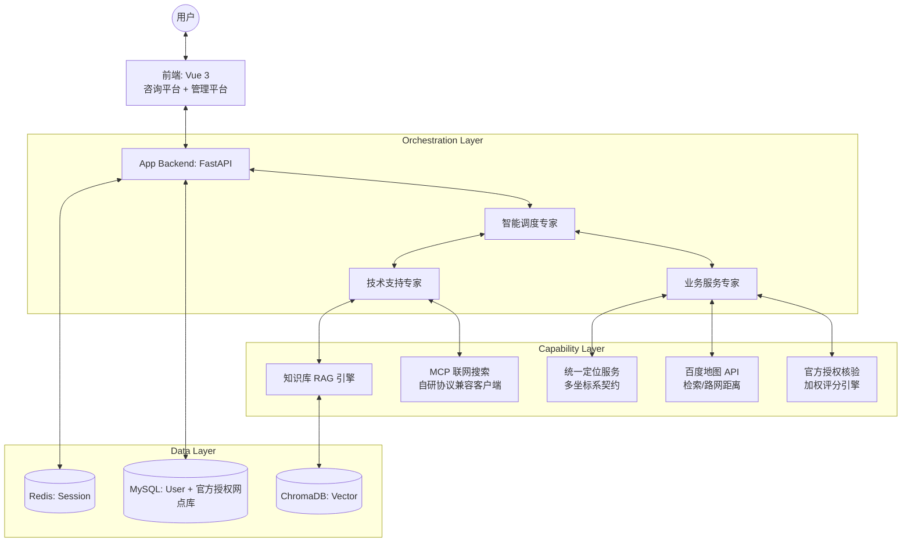

# 联想售后智能技术支持系统 (Lenovo Multi-Agent Support)

面向联想品牌产品（ThinkPad / 小新 / YOGA / ThinkCentre 等）的售后技术支持智能客服系统。基于多智能体协作架构与 RAG（检索增强生成）技术，通过分工明确的 AI 专家团队，为用户提供精准的硬件故障诊断、软件操作指导、附近官方维修网点查询及联网实时资讯问答。

## 🚀 快速启动

在项目根目录下，使用统一的开发模式启动脚本：

```powershell
python scripts/start_dev.py
```

该脚本将一键启动以下服务：
- **管理平台 (UI)**: [http://localhost:3000](http://localhost:3000)
- **咨询平台 (UI)**: [http://localhost:3002](http://localhost:3002)
- **知识库后端 (API)**: [http://127.0.0.1:8001](http://127.0.0.1:8001)
- **应用后端 (API)**: [http://127.0.0.1:8002](http://127.0.0.1:8002)

## 📦 Docker 一键部署

无需手动安装 Python/Node/MySQL/Redis，一条命令拉起全栈：

```bash
# 1. 克隆项目
git clone <repo-url> && cd its_multi_agent

# 2. 配置环境变量（填入百炼 API Key 和百度地图双 AK）
cp .env.example .env
#   编辑 .env，至少配置：
#   AL_BAILIAN_API_KEY=your_key            # 阿里云百炼 Key（三模型 + embedding）
#   BAIDU_MAP_AK=your_server_ak            # 百度地图"服务端"AK（地理编码/POI检索/路网距离）
#   BAIDU_MAP_AK_BROWSER=your_browser_ak   # 百度地图"浏览器端"AK（前端 JS API 浏览器定位）

# 3. 一键启动（首次会自动构建镜像）
docker-compose up -d

# 4. 查看服务状态
docker-compose ps
```

启动完成后访问：

| 服务 | 地址 | 说明 |
|------|------|------|
| 咨询平台 | http://localhost | 面向用户的 AI 对话界面 |
| 管理平台 | http://localhost:81 | 知识库管理与检索调试 |
| 应用后端 API | http://localhost:8002 | Agent 编排 + 工具集成 |
| 知识库 API | http://localhost:8001 | RAG 检索 + 文档管理 |
| MySQL | localhost:3307 | 用户 + 官方授权网点库 |
| Redis | localhost:6379 | 会话存储 |

> 首次构建约 5-8 分钟（已配置清华镜像源加速）。后续重启秒级完成。
> 首次使用需在咨询平台注册账号后登录即可对话。

**常用命令：**
```bash
docker-compose logs -f main-backend   # 查看后端日志
docker-compose restart frontend       # 重建后端后刷新前端 DNS
docker-compose down                   # 停止全部服务
```

## 🔧 维护工具

在 `scripts/` 目录下提供了一些常用的维护脚本：

- **数据初始化**: `python scripts/init_db_enriched.py` (向数据库注入真实的网点测试数据)
- **缓存清理**: `python scripts/flush_redis.py` (清空 Redis 中的所有会话缓存)

在 `backend/scripts/` 目录下提供服务网点数据工程脚本：

- **全国网点采集**: `python backend/scripts/import_lenovo_stations.py`
  (76 城市官方授权网点采集，支持 `--cities 武汉` 指定城市、`--dry-run` 预览；断点续传 + 配额熔断)
- **网点库统计**: `python backend/scripts/station_stats.py` (按城市查看入库网点数)

测试命令：

```powershell
python backend/tests/test_service_station_logic.py   # 44 项纯逻辑单测 (无需外部服务)
python backend/tests/e2e_test_api.py                 # 16 项 API E2E (需启动双服务)
python backend/tests/test_web_search_routing.py      # 联网搜索路由回归 (免地图配额)
```

## 🏗️ 项目架构

项目采用微服务解耦设计，核心架构逻辑如下：



### 1. 应用后端 (`backend/app`)
作为系统的“大脑”与“神经中枢”，负责 Agent 编排与业务逻辑。
- **智能调度专家 (Orchestrator)**: 意图网关三分支编排——纯服务诉求（短句+服务关键词）直连业务服务专家；复合意图（技术+服务）先技术后服务合并回答；技术/闲聊类经调度专家路由，支持 Agent 间任务交接（Handoff）。
- **三模型分工**: 调度=qwen3.7-max、技术专家=qwen3.8-max（启用 tool_stream 流式工具调用，原 glm-5.2 因百炼额度耗尽已切换）、服务专家=deepseek-v4-flash，知识库RAG生成=qwen3.7-max，按角色择优分配。
- **外部能力集成**: 通过 **MCP (Model Context Protocol)** 接入联网搜索，并通过百度地图官方 API 接入地理位置服务。
- **会话持久化**: 基于 Redis 实现分布式 Session 管理，支持多平台会话隔离。

### 2. 知识库后端 (`backend/knowledge`)
专为技术文档设计的 RAG 引擎。
- **混合检索**: 结合向量检索 (ChromaDB) 与标题关键词匹配 (Jieba)。
- **平稳退化**: 当嵌入模型 API 异常时，自动退化至关键词检索，确保系统高可用。
- **数据管理**: 支持批量 Markdown 文档解析、切分与入库。

### 3. 前端界面 (`front`)
- **咨询平台 (`agent_web_ui`)**: 面向最终用户，提供流式（SSE）对话体验。
- **管理平台 (`knowlege_platform_ui`)**: 面向管理员，用于知识库维护与检索效果调试。

## 🌟 核心工程亮点

### 1. 官方授权核验评分体系
地图检索返回的 POI 鱼龙混杂（含第三方维修店、无关店铺），系统通过**加权评分引擎**自动甄别：
- **电话归一化匹配 (0.6)**：与官方授权库比对（座机区号/400 号段归一化）
- **名称相似度 (0.25)**：编辑距离 + 品牌词校验
- **地址重合度 (0.15)**：分词 Jaccard 相似度
- 达到阈值即回填官方全字段（坐标/电话/地址），并对结果做**合并去重**（电话一致或名称相似且间距 < 150m）
- 最终输出**分级展示**：✅ 官方授权店 / ❓ 疑似官方 / ⚠️ 第三方参考

### 2. 多坐标系定位契约
同一地点在不同坐标系下数值差几百米且肉眼无法分辨，前端定位来源不可控，因此约定：
- 前端传 `"wgs84:"` / `"gcj02:"` / `"bd09:"` **前缀坐标**（浏览器 GPS、高德/腾讯 SDK、百度 SDK 均可无缝接入），后端自动转换为百度坐标系
- 兼容纯文本地点（自动地理编码）；全链路失败时 Agent **主动追问**用户所在城市，而非静默兜底

### 3. 数据采集工程（断点续传 + 配额熔断）
针对免费配额仅 100 次/天的地图 API，设计了全国 76 城市的网点采集方案：
- **逐城入库**：每城抓完立即落库，任意中断不丢数据
- **配额熔断**：一遇 302 限额立即停止，避免无效请求
- **断点续传**：已完成城市写入缓存，重跑自动跳过
- **幂等写入**：`name_addr_hash` 唯一键 + 自动迁移表结构，重复导入零副作用

### 4. MCP 协议兼容层
百炼 MCP 搜索服务存在协议不兼容问题（SSE 端点已废弃 / Streamable HTTP 新协议返回 500），自研了基于 HTTP POST 的轻量 MCP 客户端（`2024-11-05` 协议），实现了工具发现、调用与降级兜底的完整闭环。详见 `docs/INTERVIEW_QA.md` Q15。

## 🛠️ 技术栈

- **语言**: Python 3.11+ (SSE 流式接口使用 asyncio.timeout), JavaScript (Vue 3)
- **AI 模型**: 三模型分工 (Qwen3.7-Max 调度 / GLM-5.2 技术专家+RAG生成 / DeepSeek-V4-Flash 服务专家) + text-embedding-v3 向量化，统一经阿里百炼 OpenAI 兼容接口接入
- **数据库**: MySQL (用户数据 + 官方授权网点库), Redis (会话数据), ChromaDB (向量数据)
- **可观测性**: LangSmith (全链路追踪)
- **评估框架**: Ragas (量化 RAG 效果)
- **协议**: MCP (Model Context Protocol), SSE (Server-Sent Events)

## 📊 评估与监控

### 1. AI 可观测性 (LangSmith)
系统集成了 LangSmith，通过在 `.env` 中配置 `LANGCHAIN_TRACING_V2=true`，可以实时追踪：
- Agent 间的任务调度与交接过程。
- 工具调用的输入输出参数。
- 模型生成的 Token 消耗与响应耗时。

### 2. 量化评估 (Ragas)
在 `tests/evaluation/` 目录下提供了基于 Ragas 的评估脚本，支持对 Faithfulness、Relevance 等核心指标进行量化分析，确保知识库回答的准确性。

### 3. 测试金字塔
| 层级 | 位置 | 说明 | 外部依赖 |
|---|---|---|---|
| 纯逻辑单测 (47 项) | `backend/tests/test_service_station_logic.py` | 电话/名称/地址匹配、多电话拆分、坐标转换、去重合并、追问链路 | 无（毫秒级） |
| 工具冒烟测试 | `backend/tests/smoke_test_station_tool.py` | 真实 geocode → 检索 → 核验 → 距离全链路 | 百度 API + DB |
| API E2E (16 项) | `backend/tests/e2e_test_api.py` | 健康/鉴权/会话/四类对话/流式/RAG/故障对话回放/历史去重/清理 | 双服务运行 |
| 路由回归测试 | `backend/tests/test_web_search_routing.py` | 验证实时资讯走 MCP 主搜索而非本地兜底 | 后端运行 |
| **质量评测 (25 项)** | `backend/tests/eval_agent_quality.py` | 路由正确率/内容完整性/安全合规/响应时间 | 后端运行 |

### 4. 质量评测结果

自建规则断言 + 内容特征推断（不依赖 LLM-as-judge），25 条标注集覆盖路由/技术/服务/多轮/安全 5 大类：

| 指标 | 结果 |
|---|---|
| 综合通过率 | 20/25 (80%) |
| 路由正确率 | 21/25 (84%) |
| 内容完整率 | 23/25 (92%) |
| 安全合规率 | 25/25 (100%) |
| 平均响应时间 | 4.24s |

> 完整报告见 [docs/EVAL_REPORT.md](docs/EVAL_REPORT.md)。已知限制：Flash 模型在简短技术问题上有概率直接回答而不交接技术专家；部分搜索类问题倾向用训练知识而非联网搜索。

## 📂 目录说明

```text
its_multi_agent/
├── backend/
│   ├── app/           # 主应用后端 (Agent 编排与工具集成)
│   ├── knowledge/     # 知识库后端 (RAG 检索与文档管理)
│   ├── tests/         # 单元测试 / 冒烟测试 / E2E 测试
│   └── scripts/       # 网点数据采集 (断点续传) 与统计脚本
├── front/
│   ├── agent_web_ui/  # 咨询平台前端
│   └── knowlege_platform_ui/ # 管理平台前端
├── data/              # 共享数据目录 (MySQL/Chroma 数据持久化, 知识库语料)
├── docs/              # 开发日志 / 实施指南 / 面试 Q&A
├── tests/             # 结构化测试套件 (Integration/Evaluation)
└── scripts/           # 统一开发启动与数据库维护脚本
```

## ⚠️ 开发注意事项
- **环境隔离**: `backend/app` 和 `backend/knowledge` 拥有各自的 `.venv` 环境，请确保在对应环境下运行或使用 `start_dev.py`。
- **环境变量**: 请务必在各后端的 `.env` 文件中配置正确的 `API_KEY` 与服务地址。
