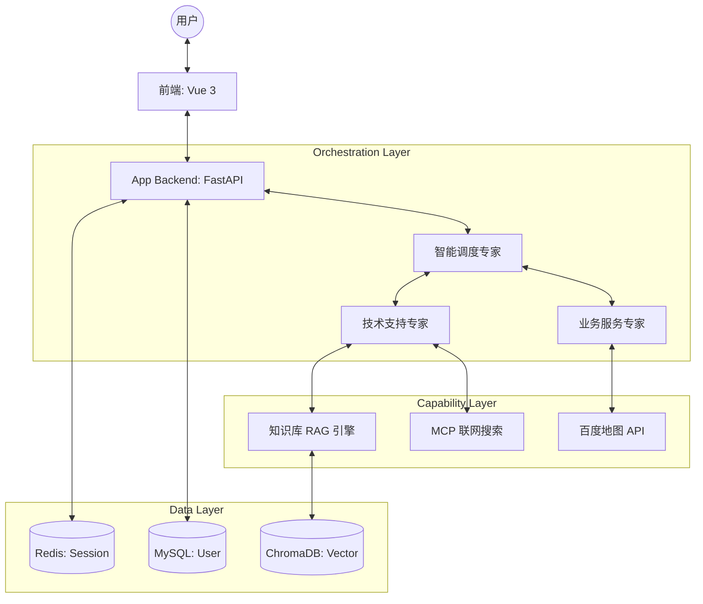

# ITS 多智能体技术支持系统 (ITS Multi-Agent)

基于多智能体协作架构与 RAG（检索增强生成）技术的智能技术支持系统，旨在通过分工明确的 AI 专家团，为用户提供精准的硬件故障诊断、软件操作指导及周边服务查询。

## 🚀 快速启动

在项目根目录下，使用统一的开发模式启动脚本：

```powershell
python scripts/start_dev.py
```

该脚本将一键启动以下服务：
- **管理平台 (UI)**: [http://localhost:3000](http://localhost:3000)
- **咨询平台 (UI)**: [http://localhost:3002](http://localhost:3002)
- **知识库后端 (API)**: [http://127.0.0.1:8001](http://127.0.0.1:8001)
- **应用后端 (API)**: [http://127.0.0.1:8002](http://127.0.0.1:8002)

## 🔧 维护工具

在 `scripts/` 目录下提供了一些常用的维护脚本：

- **数据初始化**: `python scripts/init_db_enriched.py` (向数据库注入真实的网点测试数据)
- **缓存清理**: `python scripts/flush_redis.py` (清空 Redis 中的所有会话缓存)

## 🏗️ 项目架构

项目采用微服务解耦设计，核心架构逻辑如下：



### 1. 应用后端 (`backend/app`)
作为系统的“大脑”与“神经中枢”，负责 Agent 编排与业务逻辑。
- **智能调度专家 (Orchestrator)**: 基于意图识别，将任务分发给技术或服务专家。
- **多智能体协作**: 采用多智能体协作架构，支持 Agent 间的任务交接（Handoff）。
- **外部能力集成**: 通过 **MCP (Model Context Protocol)** 接入联网搜索，并通过百度地图官方 API 接入地理位置服务。
- **会话持久化**: 基于 Redis 实现分布式 Session 管理，支持多平台会话隔离。

### 2. 知识库后端 (`backend/knowledge`)
专为技术文档设计的 RAG 引擎。
- **混合检索**: 结合向量检索 (ChromaDB) 与标题关键词匹配 (Jieba)。
- **平稳退化**: 当嵌入模型 API 异常时，自动退化至关键词检索，确保系统高可用。
- **数据管理**: 支持批量 Markdown 文档解析、切分与入库。

### 3. 前端界面 (`front`)
- **咨询平台 (`agent_web_ui`)**: 面向最终用户，提供流式（SSE）对话体验。
- **管理平台 (`knowlege_platform_ui`)**: 面向管理员，用于知识库维护与检索效果调试。

## 🛠️ 技术栈

- **语言**: Python 3.10+, JavaScript (Vue 3)
- **AI 模型**: 阿里百炼通义千问系列 (Qwen-Max, Qwen-Flash)
- **数据库**: MySQL (用户数据), Redis (会话数据), ChromaDB (向量数据)
- **可观测性**: LangSmith (全链路追踪)
- **评估框架**: Ragas (量化 RAG 效果)
- **协议**: MCP (Model Context Protocol), SSE (Server-Sent Events)

## 📊 评估与监控

### 1. AI 可观测性 (LangSmith)
系统集成了 LangSmith，通过在 `.env` 中配置 `LANGCHAIN_TRACING_V2=true`，可以实时追踪：
- Agent 间的任务调度与交接过程。
- 工具调用的输入输出参数。
- 模型生成的 Token 消耗与响应耗时。

### 2. 量化评估 (Ragas)
在 `tests/evaluation/` 目录下提供了基于 Ragas 的评估脚本，支持对 Faithfulness、Relevance 等核心指标进行量化分析，确保知识库回答的准确性。

## 📂 目录说明

```text
its_multi_agent/
├── backend/
│   ├── app/           # 主应用后端 (Agent 编排与工具集成)
│   └── knowledge/     # 知识库后端 (RAG 检索与文档管理)
├── front/
│   ├── agent_web_ui/  # 咨询平台前端
│   └── knowlege_platform_ui/ # 管理平台前端
├── data/              # 共享数据目录 (MySQL/Chroma 数据持久化)
├── tests/             # 结构化测试套件 (Unit/Integration/Playground)
└── scripts/           # 统一开发启动与数据库维护脚本
```

## ⚠️ 开发注意事项
- **环境隔离**: `backend/app` 和 `backend/knowledge` 拥有各自的 `.venv` 环境，请确保在对应环境下运行或使用 `start_dev.py`。
- **环境变量**: 请务必在各后端的 `.env` 文件中配置正确的 `API_KEY` 与服务地址。
